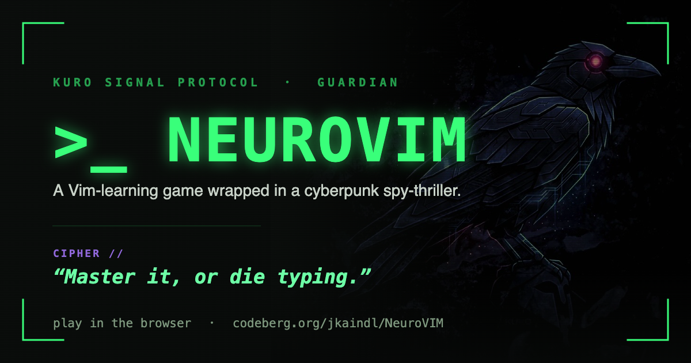
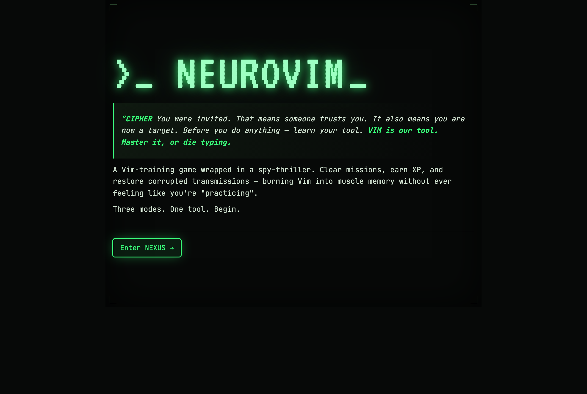
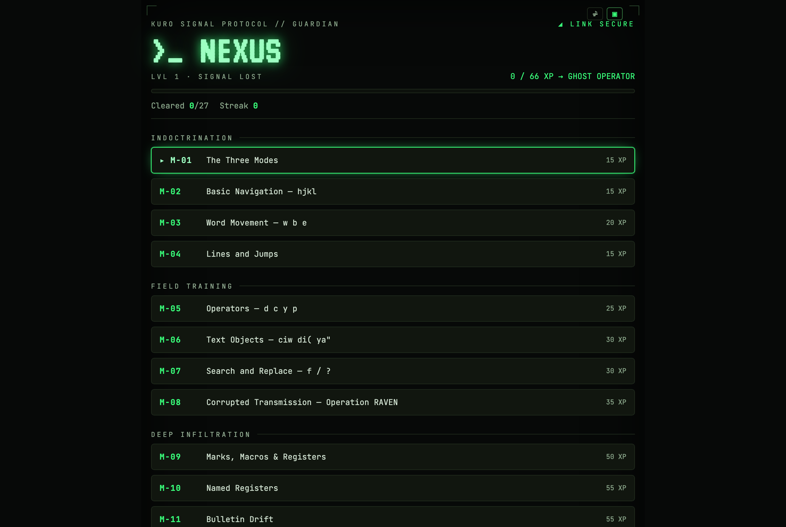
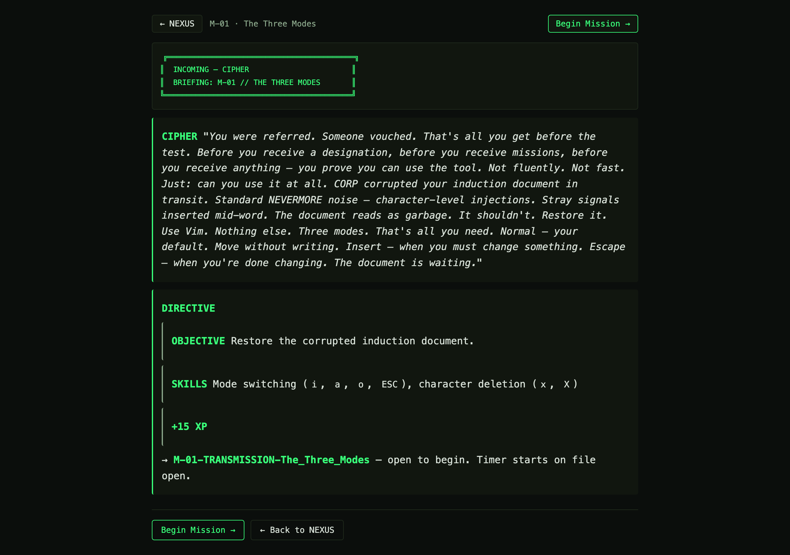
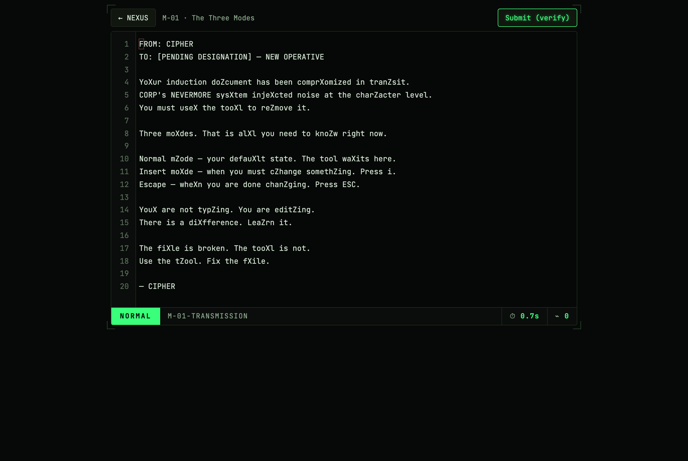
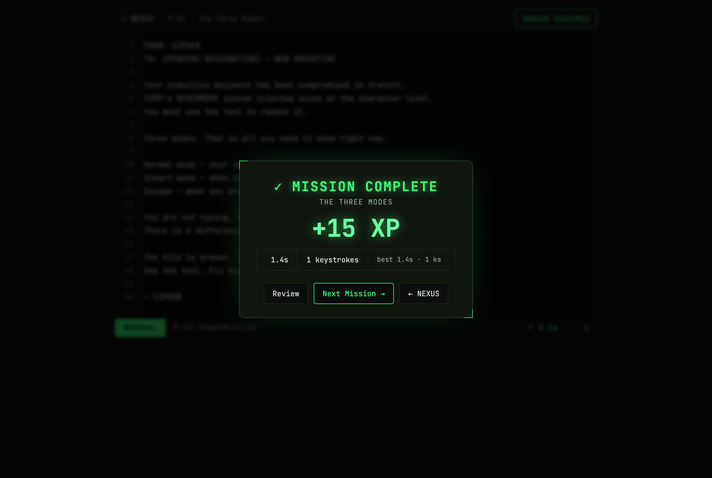
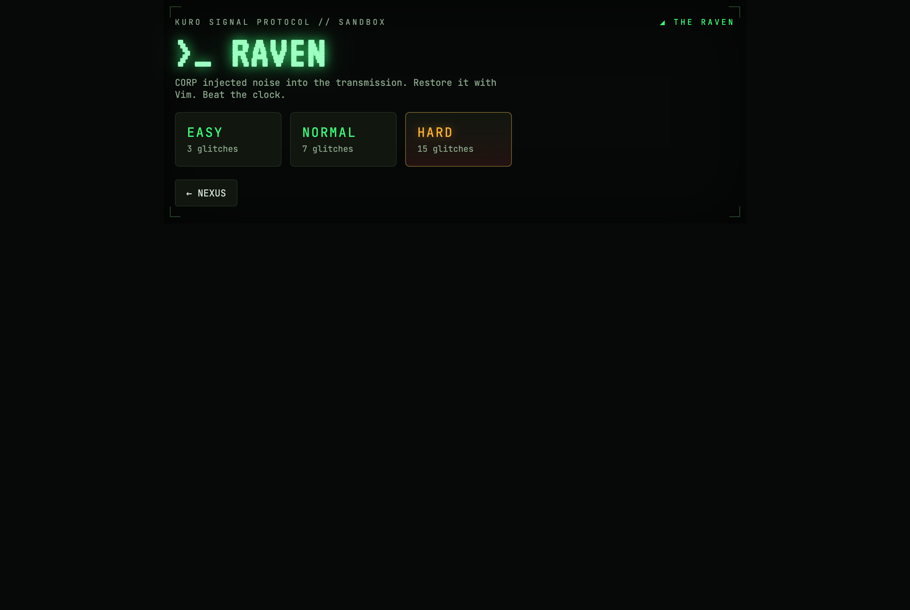
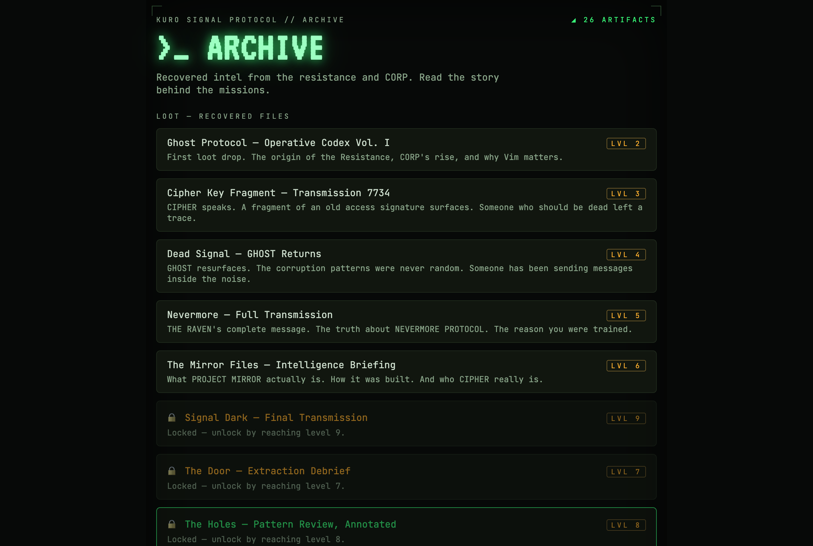
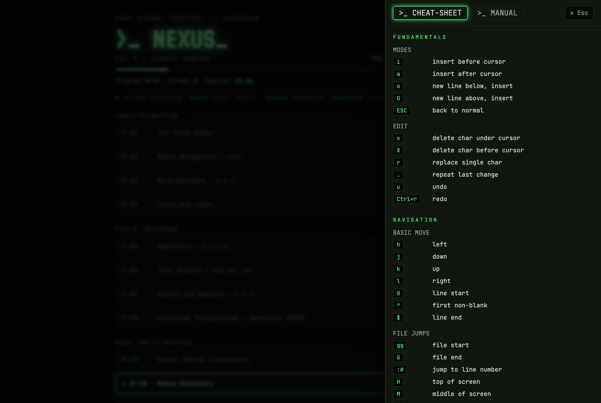

<p align="center">
  
</p>

<h1 align="center">NeuroVim</h1>

<p align="center">
  <a href="LICENSE"></a>
  <a href="https://pages.jkaindl.de/neurovim-standalone/"></a>
</p>

<p align="center"><i>Learn Vim by playing a cyberpunk spy-thriller.</i></p>

<p align="center">
  <b>▶ <a href="https://pages.jkaindl.de/neurovim-standalone/">Play in the browser</a></b>
  <sub>(<a href="https://johannes-kaindl.github.io/NeuroVIM/">GitHub Pages mirror</a>)</sub>
  &nbsp;·&nbsp;
  <a href="https://github.com/johannes-kaindl/NeuroVIM/releases">Desktop downloads</a>
</p>

An AI handler named **CIPHER** assigns you "missions" that are really Vim
exercises — restore CORP-corrupted documents, fix glitched transmissions, beat
the clock. You end up learning Vim almost by accident; the spy-thriller is the
hook. Same game ships three ways from one codebase: a **web app**, an **Obsidian
plugin**, and a **native desktop app**.

## Screenshots

<table>
  <tr>
    <td align="center"><br><sub>Welcome — CIPHER intro</sub></td>
    <td align="center"><br><sub>NEXUS — mission picker + status</sub></td>
  </tr>
  <tr>
    <td align="center"><br><sub>Briefing — story before each mission</sub></td>
    <td align="center"><br><sub>Editor — CodeMirror 6 + Vim</sub></td>
  </tr>
  <tr>
    <td align="center"><br><sub>Result — mission complete</sub></td>
    <td align="center"><br><sub>THE RAVEN — free-play sandbox</sub></td>
  </tr>
  <tr>
    <td align="center"><br><sub>Archive — unlockable lore &amp; loot</sub></td>
    <td align="center"><br><sub>Cheatsheet — Vim keymap overlay</sub></td>
  </tr>
</table>

## Features

- **Story-driven campaign** — a curriculum of Vim missions (motions, find-char, the dot
  command, operators, text objects, search & replace, macros, registers, visual-block,
  global commands, regex) wrapped in a narrative that **unlocks progressively** as you level up.
- **Real editor** — CodeMirror 6 with actual Vim keybindings, not a fake terminal.
- **THE RAVEN sandbox** — free-play: fix N injected glitches against the clock,
  beat your best (EASY / NORMAL / HARD).
- **Progression & mastery** — XP, levels, progressive mission unlock, streaks, and
  **gold/silver/bronze par-tiers** that score each run by keystrokes; progress saved
  locally in your browser.
- **Terminal / CRT aesthetic** — restrained phosphor-green "Kuro" theme, monospace,
  optional scanline.
- **Plays anywhere** — in the browser with no install, or as a ~3 MB native desktop
  app (macOS / Windows / Linux).

## Play

- **Browser:** **https://pages.jkaindl.de/neurovim-standalone/** — nothing to install.
- **Desktop:** download an installer from the [latest release](https://github.com/johannes-kaindl/NeuroVIM/releases)
  (macOS `.dmg`, Windows `.exe`/`.msi`, Linux `.AppImage`/`.deb`/`.rpm`). The macOS
  `.dmg` is Developer ID-signed + notarized (opens without a Gatekeeper warning); the
  Windows installer is currently unsigned — see [`docs/DESKTOP.md`](docs/DESKTOP.md).

## Run from source

```bash
npm install
npm run dev          # web app → http://localhost:5173/
```

```bash
npm run build        # full build (content → Obsidian plugin → web)
npm test             # test suite
npm run build:dmg    # native desktop app + macOS DMG (needs Rust + Xcode CLT)
```

Contributor guide: [`CONTRIBUTING.md`](CONTRIBUTING.md) · architecture & internals
for agents/maintainers: [`AGENTS.md`](AGENTS.md).

## Manual

New players start with the **[Player Manual](docs/manual/README.md)** — a
[Diátaxis](https://diataxis.fr/)-structured guide:

- **[Tutorial](docs/manual/tutorial.md)** — play through your first mission, no Vim
  knowledge needed.
- **[How-to guides](docs/manual/how-to/index.md)** — the sandbox, scoring, unlocks,
  desktop install, resetting progress.
- **[Reference](docs/manual/reference/index.md)** — the [Vim keymap](docs/manual/reference/vim-keymap.md)
  and [ranks & unlocks](docs/manual/reference/progression.md) (generated from the game
  data via `npm run build:manual`).
- **[Explanation](docs/manual/explanation/index.md)** — why NeuroVim is shaped the way
  it is.

## Architecture

TypeScript · [Preact](https://preactjs.com/) · [CodeMirror 6](https://codemirror.net/)
+ [@replit/codemirror-vim](https://github.com/replit/codemirror-vim) · Vite ·
[Tauri v2](https://tauri.app) · self-hosted [JetBrains Mono](https://www.jetbrains.com/lp/mono/) (OFL).

A small monorepo (npm workspaces): a platform-neutral **core** (game logic, Web
Audio, Preact UI) with thin **adapters** for the web, Obsidian, and desktop. No
UI kit, no CSS framework. See [`AGENTS.md`](AGENTS.md) for the architecture.

**Why there is a build step:** the editor is the product here, and CodeMirror 6
only exists as an npm module graph — there is no single-file drop-in. On top of
that, one source tree has to come out as three different artifacts: a lazy-loading
web bundle, a single `main.js` for the Obsidian plugin, and static assets for the
Tauri desktop shell. A bundler is what makes that one codebase instead of three.

## Consumers

This repository is the upstream for every NeuroVim target. The **vendor surface** is
`packages/core/src` (game logic, engines, ports) plus `packages/content/src`
(missions and lore). Everything else — the web app, the Tauri project, the scripts —
is a consumer of that surface, not part of it.

To build on it: copy the surface into `<your-repo>/src/vendor/neurovim/` and pin the
origin in a `VENDOR.json` next to it (`source`, `tag`, `sha`, `version`). **Never edit
the copy** — change it here and re-vendor. A copy that is edited in place is silently
discarded by the next re-vendor.

Current consumers and how far their pins lag: [`CONSUMERS.md`](CONSUMERS.md).

## Contributing

Issues and PRs welcome on [git.jkaindl.de](https://git.jkaindl.de/jkaindl/NeuroVIM)
(primary) or the [GitHub mirror](https://github.com/johannes-kaindl/NeuroVIM).
Please read [`CONTRIBUTING.md`](CONTRIBUTING.md) first.

## License

NeuroVim is **dual-licensed** — see [`LICENSING.md`](LICENSING.md).

- **Open source:** [GNU AGPL-3.0](LICENSE) — copyleft with the network-use clause:
  if you host a modified version so others can use it over the network, the source
  of your variant must also be made available under the AGPL.
- **Commercial license:** for uses that the AGPL does not fit — e.g. a proprietary
  or closed-source product, or an Apple App Store build (App Store terms are
  incompatible with the AGPL) — a separate commercial license is available. See
  [`LICENSING.md`](LICENSING.md); contributions are covered by the [CLA](CLA.md).

Documentation and narrative text (docs, missions, lore) are licensed under
[CC BY-SA 4.0](LICENSE-DOCS). The bundled JetBrains Mono font is under the
[SIL Open Font License](packages/adapter-web/src/fonts/OFL.txt).
