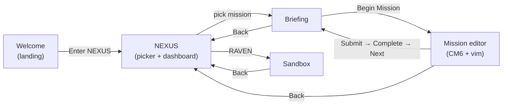

<p align="center">
  
</p>

<h1 align="center">neurovim-standalone</h1>

<p align="center">
  <b>▶ <a href="https://johannes-kaindl.github.io/NeuroVIM/">Play in the browser</a></b>
  &nbsp;·&nbsp;
  <a href="https://github.com/johannes-kaindl/NeuroVIM/releases">Desktop downloads</a> (macOS / Windows / Linux)
</p>

Monorepo for **NeuroVim** — a Vim-learning game with a spy-thriller narrative.
One codebase, three delivery targets: an Obsidian plugin + a standalone web app
+ a native desktop app via Tauri.

> **Status: Phase 3 (working).** Core fully ported, both adapters functional, web
> app feature-complete (Welcome → NEXUS → Briefing → Editor → Result + Sandbox)
> including the polish pass from `docs/DESIGN-SPEC.md`. 150 tests green,
> 4-workspace typecheck green. Build: `npm run build`.

## Architecture

Platform-neutral core + thin adapters over four port interfaces (`VimModeSource`,
`StoragePort`, `ContentPort`, `UiHost`). The core never depends on `obsidian` or
the browser DOM — platform specifics come in through the ports. Full rationale
lives in ADR-001 (in the separate design-prep workspace, not in this repo);
`AGENTS.md` has the working summary.

## Packages

| Package | Role |
|---|---|
| [`@neurovim/core`](packages/core) | Game logic, Web Audio, Preact UI, port interfaces, NEXUS dashboard |
| [`@neurovim/content`](packages/content) | Missions, katas, loot, story bible as versioned data |
| [`@neurovim/adapter-obsidian`](packages/adapter-obsidian) | Obsidian-plugin implementation of the port interfaces |
| [`@neurovim/adapter-web`](packages/adapter-web) | Web app (Vite SPA) + Tauri desktop wrapper |

## Origin

Derived from the Obsidian plugin `neurovim-trainer` v1.0.0. The original plugin is
left untouched; this monorepo is the contract. See `docs/PLUGIN-SWAP.md` for
swapping the refactored build into the original vault.

## Tooling

- **npm workspaces** (no pnpm — not installed; see decision log D1)
- **TypeScript** project references (`tsconfig.base.json`)
- Build: esbuild (library packages) / Vite (adapter-web); Tauri v2 for desktop
- Bundled monospace: self-hosted JetBrains Mono (`packages/adapter-web/src/fonts/`)

## Quickstart (dev)

```bash
npm install
npm run dev          # → http://localhost:5173/
```

`npm run dev` from the repo **root** is an alias for the `adapter-web` workspace —
no `--workspace` flag needed.

### Root convenience scripts

All callable from the repo root (`npm run <script>`):

| Script | Effect |
|---|---|
| `dev` | Vite dev server for the web app (`adapter-web`), http://localhost:5173/ |
| `build` | Full build in order: `content` → `plugin` → `web` |
| `build:content` | Only `@neurovim/content` (gray-matter → `src/generated/*.ts`) |
| `build:plugin` | Only `@neurovim/adapter-obsidian` (esbuild → `dist/main.js`) |
| `build:web` | Only `@neurovim/adapter-web` (Vite → `dist/`) |
| `build:dmg` | Native desktop app + macOS DMG (Tauri) — see `docs/DESKTOP.md` |
| `desktop:dev` | Tauri desktop app with HMR |
| `typecheck` | `tsc --noEmit` across all four workspaces |
| `test` | `jest` across all workspaces with tests (`--if-present`) |

> The build order matters: `content` generates the manifest that `plugin` and
> `web` import, so `content` runs first.

## Web-app flow (`@neurovim/adapter-web`)



Launch shows **Welcome**; every mission goes through the **Briefing** page before
the editor. Welcome/Briefing/Editor/Sandbox are lazy-loaded chunks (code
splitting); the Markdown renderer (`marked`) sits in the shared Briefing/Welcome
chunk.

## Desktop app (Tauri)

Native app wrapping the web build via Tauri v2 — uses the OS WebView, so the macOS
DMG is ~3 MB. Build locally with `npm run build:dmg`; multi-OS installers
(macOS/Windows/Linux) are built in CI on a `v*` tag. Details, including the
unsigned-Gatekeeper note, in `docs/DESKTOP.md`.

## Remotes & distribution (ADR-001 D5)

- **Primary:** `codeberg.org/jkaindl/NeuroVIM` (git remote `codeberg`)
- **Mirror:** `github.com/johannes-kaindl/NeuroVIM` (git remote `github`) — runs the desktop CI
- **Distribution:** Codeberg releases as the primary source · GitHub mirror for visibility · possibly itch.io for game-audience reach

### Deploy the web app

`packages/adapter-web/dist/` is a **static site** (relative `base: './'`, so it
deploys under any sub-path).

**Codeberg Pages** (primary): push the `dist/` contents to a `pages` branch.

```bash
cd packages/adapter-web && npx vite build
git -C ../.. worktree add /tmp/nv-pages --orphan pages
cp -R dist/. /tmp/nv-pages/ && touch /tmp/nv-pages/.nojekyll
git -C /tmp/nv-pages add -A && git -C /tmp/nv-pages commit -m "deploy web app"
git -C /tmp/nv-pages push codeberg pages   # → https://jkaindl.codeberg.page/NeuroVIM/
git -C ../.. worktree remove /tmp/nv-pages
```

**GitHub Pages** (mirror): same, but push the `pages` branch to the `github`
remote and set Pages source = `pages` branch in the repo settings.

**itch.io** (game audience, TODO): zip `dist/` (`cd dist && zip -r ../neurovim-web.zip .`)
and upload as an HTML5 game with "This file will be played in the browser" enabled.

> After deploying, update the `og:image`/`og:url` host in
> `packages/adapter-web/index.html` to the final URL so link unfurls show the card.
