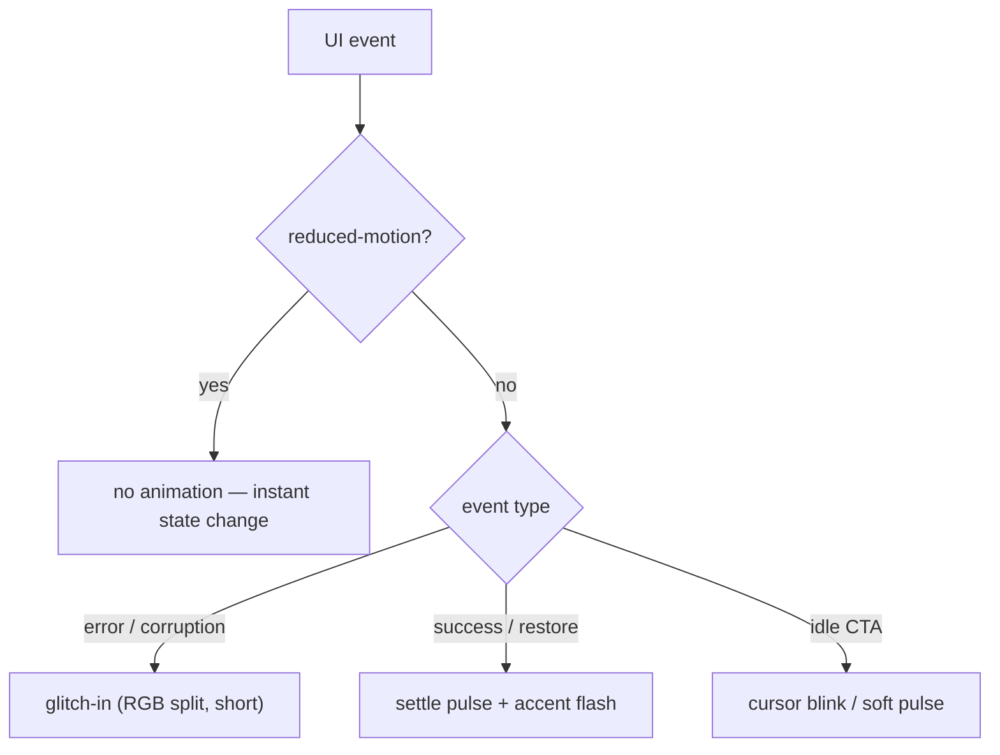
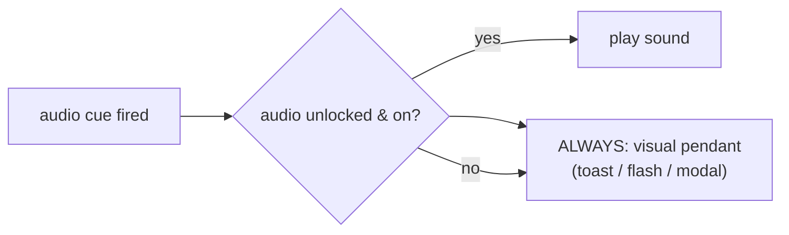

# NeuroVim Web — Design Spec (Polish Pass)

> **Audience:** a designer or a Claude-designer instance doing a visual/UX polish pass on the standalone web app (`@neurovim/adapter-web`). This is a standalone brief — you should not need to ask follow-up questions to start. Code lives one directory up; screenshots are in `docs/screenshots/`.
>
> **Status of the app:** functionally complete (Welcome → NEXUS → Briefing → Editor → Result, plus Sandbox). All views render, all flows work, 150 tests green, bundle code-split. What's missing is *deliberate visual design* — the current styling is a competent programmer-default, not an art-directed experience.

---

## 1 · TL;DR + Project Identity

**NeuroVim** is a Vim-learning game wrapped in a cyberpunk spy-thriller. The player is a freshly-recruited *operative* of a resistance cell; an AI handler called **CIPHER** assigns missions that are really Vim exercises — restore a CORP-corrupted document, fix glitched transmissions, beat the clock. Learning Vim is the disguised core loop; the story is the motivation layer.

**Design vibe:** terminal/CRT cyberpunk. Near-black background, a single **neon phosphor-green accent** (`#39ff7a`), monospace everything, `>_` prompt glyphs, ALL-CAPS designations (SIGNAL LOST, CHROME RAVEN), CORP-vs-Resistance tension. It descends from the **"Kuro" theme** of the original Obsidian plugin (`neurovim-trainer`) — keep that lineage: restrained, high-contrast, type-driven, no decorative chrome that isn't diegetic.

**Anti-goals:** no SaaS-dashboard look, no rounded pastel cards, no gradient buttons, no stock illustrations. If it doesn't feel like a terminal a spy would use, it's wrong.

---

## 2 · Current State (screenshots)

Six representative captures (1280×860 @2×, fresh save-state) live in `docs/screenshots/`. Regenerate via the headless script described in §10.

| View | Screenshot | What renders |
|---|---|---|
| Welcome | `screenshots/01-welcome.png` | Wordmark `>_ NEUROVIM`, CIPHER intro callout, two intro paragraphs, `Enter NEXUS →` CTA |
| NEXUS Picker | `screenshots/02-nexus-picker.png` | Header (level, XP bar, summary strip), ARC I mission list (27 rows), SANDBOX section |
| Briefing | `screenshots/03-briefing.png` | Top bar (back / title / begin), ASCII-art header box, CIPHER + DIRECTIVE callouts, foot actions |
| Editor | `screenshots/04-editor.png` | Top bar (back / title / submit), CodeMirror 6 + vim editor with line numbers, corrupted transmission text |
| Result Modal | `screenshots/05-result-modal.png` | Overlay: ✓ MISSION COMPLETE, +XP, run + best metrics, Review / Next / NEXUS |
| Sandbox | `screenshots/06-sandbox.png` | RAVEN difficulty picker (EASY/NORMAL/HARD), per-difficulty glitch count + PB |

Embedded for convenience:

---

## 3 · Design System (current)

All values are extracted from `packages/adapter-web/src/styles.css`. **Everything funnels through six CSS variables** — respect them; never hardcode hex.

### Color tokens (`:root`)

| Var | Hex | Role |
|---|---|---|
| `--nv-bg` | `#0b0e0c` | Page background (near-black, faint green cast) |
| `--nv-panel` | `#11160f` | Cards, buttons, blockquotes, code blocks |
| `--nv-border` | `#1f2a1c` | All borders, dividers, the un-filled XP track |
| `--nv-accent` | `#39ff7a` | Phosphor green — links, CTAs, headings, progress fill, success |
| `--nv-text` | `#d7e0d7` | Body text (off-white, green-tinted) |
| `--nv-muted` | `#8aa68a` | Secondary text — subtitles, stats, XP labels |

**Un-tokenized status colors** (currently hardcoded — should become vars): error/fail red `#ff6b6b` (modal-fail title, sandbox "remaining"), modal backdrop `rgba(0,0,0,0.72)`, modal shadow `rgba(0,0,0,0.6)`.

### Typography

- **Family:** `ui-monospace, monospace` only. No web-font load (system mono — SF Mono / Menlo / Consolas). One typeface for the whole app, by design.
- **Scale (current, ad-hoc):** h1 ≈ browser default (~32px, accent, `letter-spacing: 1px`); modal title 20px; modal XP 28px; body ≈ 16px (inherited); secondary 13–14px; fine print 11–12px (badges, XP labels). `line-height: 1.6` on prose (`.nv-md`).
- There is **no formal type scale** — a polish opportunity (see §4 Welcome / §9).

### Spacing

Informal 4px-ish base; common values in use: 4, 6, 8, 10, 12, 14, 16, 18, 22, 24, 28. **Radius:** 3 / 4 / 6 / 8px. No shadow except the modal. Container widths: 820px (app/doc), 900px (editor).

### Components (selector → snippet → usage)

| Component | Key style | Where |
|---|---|---|
| **Button (default)** | `background: var(--nv-panel); border: 1px solid var(--nv-border); border-radius: 4px; padding: 6–14px` · hover → `border-color: var(--nv-accent)` | back buttons, modal/doc actions |
| **Button (primary)** | `.nv-modal-primary` / `.nv-submit` → `border-color + color: var(--nv-accent) !important` | Begin Mission, Next, Submit, Enter NEXUS |
| **Card (selectable)** | `.nv-picker button` / `.nv-sandbox-diff` → panel bg, border, radius 4–6, full-width flex row / fixed-min column · hover border accent | mission rows, difficulty tiles |
| **Modal** | `.nv-modal` → centered, panel bg, radius 8, `box-shadow: 0 8px 40px rgba(0,0,0,.6)`, backdrop `rgba(0,0,0,.72)` | result modal |
| **Progress bar** | `.nv-xpbar` track (panel + border, 6px) + `.nv-xpbar-fill` (accent, `transition: width .4s`) | NEXUS level progress |
| **Badge** | `.nv-mbest` → accent, 11px, `opacity .75` · `.nv-done` → accent ✓ | per-mission best metrics |
| **Blockquote / callout** | `.nv-md blockquote` → panel bg, `border-left: 2px solid accent`, nested → muted border | briefing/welcome markdown |
| **Code / ASCII** | `.nv-md pre` → panel + border; `pre code` → accent monospace, `white-space: pre` | ASCII art in briefings |

The **only transition** in the codebase is the XP-bar width. Hover states are instant border-color swaps.

---

## 4 · View-by-View Spec

### Welcome (`WelcomeView.tsx`)
- **Does:** first screen on load; the story hook + entry CTA.
- **Current:** left-aligned wordmark + CIPHER callout + two paragraphs + `Enter NEXUS →`, vertically centered (`min-height: 70vh`). Markdown-rendered from `@neurovim/content` `getWelcome()`.
- **Polish wishes:** this is the front door and currently reads like a README. Wants a *hero moment* — a proper type-scale jump on the wordmark, optional terminal boot/typing intro, more vertical rhythm. The CTA is small relative to its importance. Consider a faint scanline/CRT vignette on the bg (reduced-motion aware).
- **A11y:** CTA needs a visible focus ring (currently none beyond browser default). Accent-on-bg contrast is excellent; muted body text should be verified ≥ 4.5:1.

### NEXUS Picker (`App.tsx`)
- **Does:** hub — operator status (level, XP-to-next, streak, fastest), full mission list, sandbox entry.
- **Current:** header block (level row + XP bar + stats strip) over a flat single-column list of 27 rows, then a SANDBOX section. Completed rows show a best-metrics badge + ✓.
- **Polish wishes:** 27 flat rows is a long scroll with weak hierarchy — tiers (INDOCTRINATION / FIELD TRAINING / …) exist in the data but aren't visually grouped here (the Obsidian NEXUS groups them). Locked vs. unlocked vs. completed states are not visually distinct. Consider tier headers, a completed-state treatment (dimmed + ✓), and a locked-state (the data has `locked`/`unlocked`). Tile-grid vs. list is an open question (§9).
- **A11y:** list is keyboard-tabbable (native buttons) ✓; needs focus-visible styling and possibly `aria-label` with XP/status on each row.

### Briefing (`BriefingView.tsx`)
- **Does:** story briefing shown before every mission; renders the mission's `briefingBody` markdown.
- **Current:** top bar (← NEXUS / `M-NN · Title` / Begin Mission →), then rendered markdown (ASCII box as `<pre>`, CIPHER/DIRECTIVE/OBJECTIVE/SKILLS as left-accent blockquotes), foot with duplicate Begin/Back.
- **Polish wishes:** the rendering is functional but callouts are visually uniform (all green left-border) — the source distinguishes `[!quote]` / `[!warning]` / `[!tip]` / `[!success]` types whose colors/icons are currently dropped (D25). Restoring type-aware callout styling (color + small icon) would make briefings much richer (§9). The ASCII box is a highlight — lean into it.
- **A11y:** prose contrast good; ensure the `<pre>` ASCII (accent on panel) clears 4.5:1; long briefings need clear focus order between the two CTA pairs.

### Editor (`MissionEditor.tsx`)
- **Does:** the actual exercise — CodeMirror 6 + `@replit/codemirror-vim`, 60vh, line numbers, the corrupted text to fix.
- **Current:** top bar (← NEXUS / title / Submit) + CM6 host. The CM6 theme is inline: 14px mono, 60vh, `1px solid #1f2a1c` border. Default CM6 light gutter/selection (NOT themed to match).
- **Polish wishes:** the editor is the heart of the product and is the *least* art-directed surface — CM6 ships default colors that clash with the cyberpunk palette (light gutter, default cursor/selection). Needs a full CM6 theme: phosphor cursor, dark gutter, accent selection, line-number muting. **No visible Vim-mode indicator** (Normal/Insert/Visual) — a major UX gap for learners (§9). Submit affordance is a plain top-right button.
- **A11y:** CM6 handles editor a11y; the surrounding bar needs focus-visible. Vim-mode state should be announced (aria-live) for screen-reader learners.

### Sandbox (`SandboxView.tsx`)
- **Does:** THE RAVEN free-play — pick difficulty, fix N injected glitches against the clock, beat your PB.
- **Current:** `>_ RAVEN SANDBOX` header + intro line + three difficulty tiles (EASY/NORMAL/HARD with glitch count + PB) + ← NEXUS. Active state reuses the editor layout; result is an inline accent banner.
- **Polish wishes:** difficulty tiles are plain; could carry more menace/identity (HARD should *feel* harder). The active-run state has no prominent timer (it's tracked but the HUD is minimal) — a live countdown/elapsed display would raise tension. Result banner is understated for a "you beat CORP" moment.
- **A11y:** tiles tabbable; live timer (if added) must be `aria-live="off"`/polite to avoid spam.

### Result Modal (`MissionResult.tsx`)
- **Does:** post-submit overlay — complete (XP, level-up, run + best metrics, Next) or fail (lines-differ count, Retry).
- **Current:** centered card, success title accent / fail title red, big +XP, metrics stack, action row. Backdrop click = dismiss.
- **Polish wishes:** the complete state is the reward beat and is visually modest — this is where celebration belongs (§9: confetti/particles question, weighed against the somber resistance tone). Level-up deserves more than a one-line text. Fail state is fine but could be more encouraging/diegetic ("transmission still corrupted").
- **A11y:** modal needs focus-trap + `role="dialog"`/`aria-modal` (partially present), Escape-to-close, and initial focus on the primary action.

---

## 5 · Motion & Animation

- **Current:** essentially none — only `.nv-xpbar-fill width .4s ease` + instant hover border swaps.
- **Opportunity (diegetic):** the story is literally about *signal corruption vs. restoration*. Motion should mean something:
  - **Glitch-in** on CORP/error states (brief RGB-split / jitter on the fail title, on "N remaining").
  - **Restore/settle** on success (a clean "lock-in" pulse on ✓ MISSION COMPLETE).
  - **Cursor blink** on the `>_` prompt glyph (welcome wordmark, headers) — cheap, very on-theme.
  - **Pulse** on the primary CTA when it's the obvious next step (Enter NEXUS, Begin Mission).
  - **XP-bar fill** already animates; add a brief accent flash when XP is gained.
- **Hard rule:** wrap *all* non-essential motion in `@media (prefers-reduced-motion: reduce)` and disable it there. The XP-bar transition should also be neutralized under reduced-motion.

---

## 6 · Audio Integration

- **Ratified (D4):** non-intrusive, **no autoplay**; the `AudioContext` unlocks on the first user gesture (`pointerdown` / Enter NEXUS). Ambient defaults OFF.
- **Current gap:** there is **no visible audio toggle** in the UI and **no visual pendant** for audio cues. The engine fires cues (mission complete, glitch fix, level up, wrong attempt) but a muted/headphones-off player gets nothing.
- **Wants:**
  - A persistent, unobtrusive **audio toggle** (muted by default-feel) — suggest top-right corner, a small `♪`/`mute` glyph in accent/muted, present on every view.
  - **Visual pendants** for every audio cue so the game is fully playable silent: complete → the modal already covers it; level-up → a dedicated visual beat (§4 modal); wrong attempt → the fail title glitch (§5); glitch-fix in sandbox → a subtle accent flash on the fixed line / remaining counter tick.
  - A first-run hint that audio exists (one-time, dismissible) — tie to the `onboarded` flag in `PluginData` (currently unused on web).

---

## 7 · Responsive Strategy

- **Current:** desktop-primary. Containers cap at 820/900px and center; the editor is `60vh`. Most rows/strips use `flex-wrap`, so they *degrade* rather than break.
- **Known concerns at ≤375px:** the NEXUS mission rows (id + title + badges + XP + ✓ in one flex row) will get cramped; the briefing top bar (back + long title + Begin) will wrap awkwardly; the editor at 60vh with a mobile keyboard is unproven; CM6 + on-screen Vim on a phone is a genuine UX question (Vim without a physical keyboard is hard).
- **Ask of the designer:** decide the mobile stance — (a) graceful read-only/teaser on phones with a "best on desktop" note, or (b) a real mobile layout. At minimum verify the app stays *legible and navigable* at 375px (no horizontal scroll, tappable targets ≥ 44px). Tablet (≥768px) should be fine as a narrowed desktop.

---

## 8 · Branding / Identity

- **Wordmark:** `>_ NEUROVIM` (accent, letter-spaced). No logo mark. The `>_` prompt is the de-facto brand glyph — could be formalized.
- **Favicon:** a single emoji SVG data-URI (📟 pager, `U+1F4DF`) in `index.html`. Functional stub; a real mark (the `>_` glyph as SVG) would be stronger and consistent.
- **Social card:** `index.html` has `og:title`, `og:description`, `og:type` and `<meta name="description">`. **Missing:** `og:image` (the big one for itch.io / Codeberg-Pages / link unfurls), `og:url`, and Twitter-card tags. A 1200×630 OG image in the cyberpunk palette is a clear win.
- **Tone of voice:** two registers, keep them distinct. **CIPHER voice** = terse, ominous, second-person, ALL-CAPS designations ("You were invited. … Master it, or die typing."). **System/UI voice** = neutral, functional (button labels, stat names). Don't let CIPHER's drama leak into utilitarian UI chrome, and don't let UI blandness leak into story surfaces.

---

## 9 · Open Questions (designer input wanted)

Each has direct polish leverage:

1. **Welcome hero** — keep the text + CIPHER quote, or add an ASCII-art animation / a small `>_` SVG logo / a terminal-boot typing intro? (Bundle budget applies — see §11.)
2. **NEXUS layout** — tile/grid of mission cards, or the current list? If list: group by tier with headers? How to show locked vs. unlocked vs. completed?
3. **Briefing callouts** — restore Obsidian-style **type-aware** colors + icons for `[!warning]` / `[!tip]` / `[!success]` / `[!quote]` (currently all uniform green)? (See D25.)
4. **Editor Vim-mode indicator** — add a Normal/Insert/Visual mode chip (and a themed CM6 color scheme)? Strongly recommended for learners.
5. **Sandbox live cursor-hint** — port the Obsidian behavior where the hint for the glitch on the current line shows live as you move the cursor? Plus a prominent run timer?
6. **Result modal celebration** — confetti/particles on mission-complete? **Story tension:** the player is resistance winning against CORP — celebration should read as grim satisfaction / "signal restored", not party confetti. Designer call on tone.

---

## 10 · Designer Workflow / Update Mechanism

- **Primary:** edit CSS directly in `packages/adapter-web/src/styles.css` (one file, all app styles) and the inline CM6 theme in `MissionEditor.tsx` / `SandboxView.tsx`. Run `npm run dev` (from repo root) → http://localhost:5173/ for live HMR.
- **Mockups:** drop static comps as images in `docs/mockups/` (create as needed) and reference them from this spec or a PR. No Figma in this project's setup — image mockups + direct CSS are the loop.
- **Screenshots:** the six in `docs/screenshots/` were captured headless. To regenerate after changes: run `npm run dev`, then a Playwright(-core) headless script that walks Welcome → Enter NEXUS → M-01 → Begin → solve (`:%s/X//g`, `:%s/Z//g`) → Submit → Sandbox, shooting each view (1280×860 @2×). (The script was a throwaway in `/tmp`; re-create or ask CC to.)
- **Iteration unit:** prefer small, reviewable CSS patches per view over a big-bang restyle, so the maintainer can verify each against tests/build.

---

## 11 · Tech Constraints (read before styling)

- **Stack:** Preact 10 + plain CSS. **No Tailwind, no CSS-in-JS, no UI kit.** Class names are hand-written BEM-ish `nv-*`.
- **Tokens, not hex:** style through the six `--nv-*` vars. If you need a new color (e.g. callout-type colors, a real status-token for `#ff6b6b`), **add it as a `:root` variable** rather than inlining.
- **Bundle budget:** the app is code-split (initial ~310 KB; CM6 ~408 KB lazy; `marked` ~43 KB lazy). Don't add heavy deps for visuals — prefer CSS for motion/effects over JS libraries. Any new dependency must justify its weight and ideally be lazy-loaded.
- **Respect the lineage:** the original Obsidian plugin's "Kuro" theme is the visual ancestor — restrained, terminal, type-led. New surfaces should look like they belong to the same product, not a redesign.
- **Don't break the flow/tests:** view routing is `welcome → nexus → briefing → mission` (+ `nexus → sandbox`); 150 tests + 4-workspace typecheck must stay green. Styling changes shouldn't touch logic.

---

*Spec for `@neurovim/adapter-web`. Screenshots: `docs/screenshots/`. Code: `packages/adapter-web/src/`. Design tokens: `styles.css :root`. Decisions log: `20_Claude/neurovim-standalone-prep/90_workflow-log/decisions.md` (D1–D26).*
